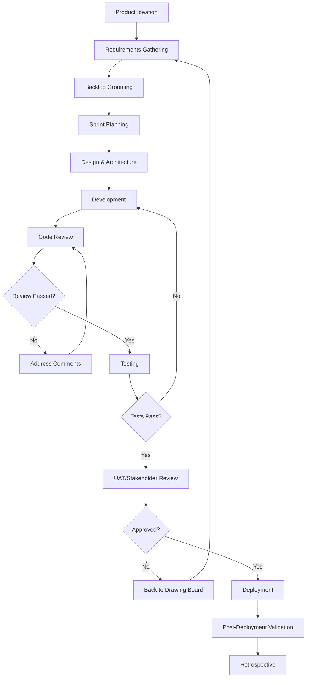

# Enterprise Agile Software Development Lifecycle

This document defines the complete Agile SDLC workflow that the Multi-Agent Squad follows, mirroring enterprise best practices.

## 🔄 Complete Development Lifecycle



## 📋 Phase 1: Product Ideation & Discovery

### Participants
- Product Manager Agent
- Solution Architect Agent
- Human Stakeholders

### Activities
1. **Market Research**
   - Competitive analysis
   - User research
   - Market sizing

2. **Feasibility Study**
   - Technical feasibility
   - Resource assessment
   - Risk analysis

3. **Business Case**
   - ROI projection
   - Success metrics
   - Go/No-Go decision

### Human Checkpoints
- ✅ Business stakeholder approval
- ✅ Technical feasibility sign-off
- ✅ Budget approval

### Deliverables
- Product Vision Document
- Initial Business Requirements
- Feasibility Report

## 📝 Phase 2: Requirements & Planning

### Participants
- Product Manager Agent
- Technical Lead Agent
- QA Engineer Agent
- Human Product Owner

### Activities
1. **Requirements Gathering**
   ```
   PM Agent: Creates comprehensive PRD
   Tech Lead: Reviews technical feasibility
   QA Agent: Defines acceptance criteria
   Human: Validates and approves requirements
   ```

2. **User Story Creation**
   - INVEST criteria (Independent, Negotiable, Valuable, Estimable, Small, Testable)
   - Acceptance criteria for each story
   - Story pointing and estimation

3. **Backlog Grooming**
   - Prioritization using MoSCoW
   - Dependency identification
   - Risk assessment per story

### Human Checkpoints
- ✅ Product Owner approval on requirements
- ✅ Technical Lead sign-off on estimates
- ✅ Stakeholder alignment meeting

### Deliverables
- Product Requirements Document (PRD)
- User Stories with Acceptance Criteria
- Prioritized Product Backlog

## 🏃 Phase 3: Sprint Planning

### Participants
- All Agents
- Scrum Master (Orchestrator)
- Human Team Lead

### Sprint Ceremony Schedule
```
Monday: Sprint Planning (2-4 hours)
Daily: Stand-ups (15 minutes)
Friday: Sprint Review & Retrospective
```

### Activities
1. **Sprint Planning Meeting**
   ```
   Orchestrator: "Starting Sprint Planning for Sprint #X"
   - Review velocity from last sprint
   - Pull stories from backlog based on capacity
   - Break down into tasks
   - Assign to appropriate agents
   ```

2. **Task Assignment**
   - Frontend tasks → Frontend Engineer Agent
   - Backend tasks → Backend Engineer Agent
   - Testing tasks → QA Engineer Agent
   - Documentation → Technical Writer Agent

### Human Checkpoints
- ✅ Sprint goal approval
- ✅ Commitment confirmation
- ✅ Risk acknowledgment

## 🏗️ Phase 4: Design & Architecture

### Participants
- Solution Architect Agent
- Technical Lead Agent
- Security Architect Agent
- Human Architect (for review)

### Activities
1. **Architecture Design**
   - System design documents
   - API specifications
   - Database schema
   - Security architecture

2. **Design Review**
   ```
   Architect Agent: Creates design
   Security Agent: Security review
   Tech Lead: Implementation review
   Human Architect: Final approval
   ```

### Quality Gates
- [ ] Scalability addressed
- [ ] Security reviewed
- [ ] Performance considerations
- [ ] Cost analysis complete
- [ ] Disaster recovery planned

### Human Checkpoints
- ✅ Architecture review meeting
- ✅ Security sign-off
- ✅ Final design approval

## 💻 Phase 5: Development

### Participants
- Frontend Engineer Agent
- Backend Engineer Agent
- DevOps Engineer Agent
- Human Developers (for complex issues)

### Development Workflow
1. **Feature Branch Creation**
   ```bash
   ./scripts/worktree-manager.sh create-feature [feature-name] [repos]
   ```

2. **Test-Driven Development**
   - Write tests first
   - Implement feature
   - Refactor as needed

3. **Daily Progress**
   ```
   Daily Stand-up (Automated):
   - What was completed yesterday?
   - What's planned for today?
   - Any blockers?
   ```

### Coding Standards
- Code style enforcement (linting)
- Unit test coverage > 80%
- Documentation for all public APIs
- Security scanning on commit

### Human Checkpoints
- ✅ Daily stand-up review
- ✅ Blocker resolution
- ✅ Complex problem assistance

## 🔍 Phase 6: Code Review Cycle

### Participants
- Senior Engineer Agents
- Security Agent
- Human Senior Developer

### Review Process
1. **Automated Checks**
   ```yaml
   on_pr_creation:
     - Run linters
     - Run unit tests
     - Security scan
     - Coverage check
   ```

2. **Agent Review**
   ```
   Senior Engineer: Code quality review
   Security Agent: Security review
   Performance Agent: Performance review
   ```

3. **Review Comments**
   - Must be specific and actionable
   - Include code suggestions
   - Link to best practices

4. **Comment Resolution**
   ```
   For each comment:
   1. Developer Agent addresses comment
   2. Pushes changes
   3. Requests re-review
   4. Reviewer verifies fix
   ```

### Review Checklist
- [ ] Functionality correct
- [ ] Tests adequate
- [ ] Performance acceptable
- [ ] Security validated
- [ ] Documentation complete
- [ ] No technical debt added

### Human Checkpoints
- ✅ Complex changes review
- ✅ Architecture alignment
- ✅ Final approval

## ✅ Phase 7: Testing

### Participants
- QA Engineer Agent
- Performance Engineer Agent
- Human QA Lead

### Testing Levels
1. **Unit Testing** (During development)
2. **Integration Testing** (After merge)
3. **System Testing** (Full flow)
4. **Performance Testing** (Load scenarios)
5. **Security Testing** (Penetration tests)
6. **UAT** (User acceptance)

### Test Execution
```
QA Agent executes:
1. Smoke tests (5 minutes)
2. Regression suite (30 minutes)
3. New feature tests (varies)
4. Performance benchmarks
```

### Bug Workflow
```
If bugs found:
1. Create bug ticket
2. Assign severity (P0-P3)
3. Route to appropriate developer
4. Fix → Test → Verify cycle
```

### Human Checkpoints
- ✅ Test plan approval
- ✅ UAT sign-off
- ✅ Go/No-go decision

## 🚀 Phase 8: Deployment

### Participants
- DevOps Engineer Agent
- SRE Agent
- Human Ops Team

### Deployment Process
1. **Pre-Deployment**
   - Change advisory board approval
   - Rollback plan ready
   - Monitoring alerts configured

2. **Deployment Steps**
   ```
   1. Blue-green deployment prep
   2. Deploy to staging
   3. Smoke tests on staging
   4. Deploy to production (canary)
   5. Monitor metrics
   6. Full rollout or rollback
   ```

3. **Post-Deployment**
   - Monitor error rates
   - Check performance metrics
   - Validate business metrics

### Human Checkpoints
- ✅ Deployment approval
- ✅ Go-live decision
- ✅ Rollback decision (if needed)

## 📊 Phase 9: Monitoring & Feedback

### Continuous Monitoring
- Error rates
- Performance metrics
- User satisfaction
- Business KPIs

### Feedback Loops
```
User Feedback → PM Agent → Backlog
Production Issues → SRE Agent → Bug Fix
Performance Issues → Perf Agent → Optimization
```

## 🔄 Sprint Ceremonies

### Daily Stand-up (Automated)
```
Time: 9:00 AM daily
Duration: 15 minutes
Format:
- Yesterday's progress
- Today's plan
- Blockers
- Human input needed?
```

### Sprint Review
```
Time: End of sprint
Duration: 1 hour
Activities:
- Demo completed features
- Gather feedback
- Update product backlog
```

### Sprint Retrospective
```
Time: After sprint review
Duration: 1 hour
Format:
- What went well?
- What could improve?
- Action items
```

## 🎯 Quality Gates

### Definition of Done
- [ ] Code complete and reviewed
- [ ] Unit tests written and passing
- [ ] Integration tests passing
- [ ] Documentation updated
- [ ] Security scan passed
- [ ] Performance benchmarks met
- [ ] Deployed to staging
- [ ] PO acceptance received

### Release Criteria
- [ ] All stories in sprint completed
- [ ] No P0/P1 bugs
- [ ] Performance SLAs met
- [ ] Security review passed
- [ ] Documentation complete
- [ ] Rollback plan tested

## 🔔 Automated Workflows & Hooks

### Git Hooks
```bash
# pre-commit
- Linting
- Unit tests
- Security scan

# pre-push
- Integration tests
- Build verification

# post-merge
- Deploy to staging
- Run smoke tests
```

### GitHub Actions
```yaml
on_pr:
  - Code quality checks
  - Test execution
  - Security scanning
  - Review assignment

on_merge:
  - Build and package
  - Deploy to staging
  - Integration tests
  - Notify team
```

### Scheduled Jobs
```
Daily:
- Stand-up report generation
- Metrics collection
- Dependency updates check

Weekly:
- Sprint progress report
- Technical debt assessment
- Security vulnerability scan

Sprint End:
- Velocity calculation
- Retrospective data collection
- Sprint report generation
```

## 👥 Human-in-the-Loop Checkpoints

### Critical Decision Points
1. **Requirement Approval** - Product Owner
2. **Design Approval** - Tech Lead/Architect
3. **Sprint Commitment** - Whole Team
4. **PR Approval** - Senior Developer
5. **UAT Sign-off** - Product Owner
6. **Deployment Approval** - Operations Team
7. **Rollback Decision** - On-call Engineer

### Escalation Matrix
```
Issue Type          | First Contact      | Escalation
-------------------|-------------------|------------------
Requirements       | Product Owner     | VP Product
Technical Blocker  | Tech Lead        | Principal Engineer
Security Issue     | Security Team    | CISO
Production Issue   | On-call Engineer | Engineering Manager
Budget Overrun     | Project Manager  | Director
```

## 📈 Metrics & Reporting

### Sprint Metrics
- Velocity (story points completed)
- Burndown chart
- Cycle time
- Defect density
- Code coverage

### Quality Metrics
- Defect escape rate
- Mean time to resolution
- Test automation percentage
- Technical debt ratio

### Business Metrics
- Feature adoption rate
- User satisfaction (NPS)
- Time to market
- ROI per feature

## 🔄 Continuous Improvement

### Regular Reviews
- Sprint retrospectives
- Quarterly process review
- Annual methodology assessment

### Improvement Actions
- Process optimization
- Tool upgrades
- Training needs
- Automation opportunities

---

This workflow ensures enterprise-grade software delivery with proper controls, quality gates, and human oversight while leveraging AI agents for efficiency.