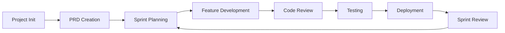

# Multi-Agent Squad Workflows

This directory contains all the modular workflows for the Multi-Agent Squad orchestration system. Each workflow guides you through specific development phases with step-by-step instructions.

## 🎯 Core Workflows

### 1. [Project Initialization](project-initialization.md)
**Purpose**: Set up a new project from scratch
- Interactive project setup
- Directory structure creation
- Agent deployment
- Integration configuration

**Start with**: `/project` or "start new project"

### 2. [PRD Creation](prd-creation.md)
**Purpose**: Create Product Requirements Documents and break them into tasks
- Requirements gathering
- PRD generation
- Task breakdown
- Sprint planning preparation

**Start with**: "create PRD" or "define requirements"

### 3. [Feature Development](feature-development.md)
**Purpose**: Guide complete feature development from design to testing
- Architecture review
- Test-driven development
- Implementation tracking
- Code review cycles

**Start with**: "start development" or "implement feature"

### 4. [Sprint Management](sprint-management.md)
**Purpose**: Handle agile ceremonies and sprint tracking
- Sprint planning
- Daily standups
- Sprint reviews
- Retrospectives

**Start with**: "start sprint" or "sprint planning"

### 5. [Deployment](deployment.md)
**Purpose**: Manage deployment from staging to production
- Pre-deployment checks
- Deployment strategies
- Monitoring
- Rollback procedures

**Start with**: "deploy" or "release to production"

## 📊 Supporting Workflows

### 6. [Workflow Tracker](workflow-tracker.md)
**Purpose**: Monitor and track workflow progress
- Status tracking
- Progress visualization
- Metrics collection
- Historical tracking

## 🔄 Workflow Lifecycle



## 🛠️ Customizing Workflows

Each workflow can be customized by:
1. Editing the workflow markdown file
2. Adding custom steps
3. Modifying decision points
4. Changing automation levels

## 📝 Workflow Principles

1. **Sequential Progress** - Complete each step before moving to the next
2. **Clear Checkpoints** - Verify prerequisites before proceeding
3. **Human-in-the-Loop** - Critical decisions require approval
4. **Status Tracking** - Always update PROJECT_STATUS.md
5. **Agent Delegation** - Use specialized agents for tasks

## 🚀 Getting Started

New to Multi-Agent Squad? Follow this path:

1. Start with [Project Initialization](project-initialization.md)
2. Create your first [PRD](prd-creation.md)
3. Begin [Feature Development](feature-development.md)
4. Use [Sprint Management](sprint-management.md) for iterations
5. Complete with [Deployment](deployment.md)

## 📊 Workflow Status

Check your current workflow status:
```bash
cat PROJECT_STATUS.md
```

## 🔗 Quick Links

- [Main Orchestration](../../CLAUDE.md) - Core orchestration guidelines
- [Agent Directory](../../.claude/agents/) - Available AI agents
- [System Scripts](../../scripts/) - Utility scripts
- [Integration Docs](../INTEGRATIONS.md) - Tool integrations

## 💡 Tips

- Always check prerequisites before starting a workflow
- Use the workflow tracker to monitor progress
- Delegate to specialized agents for best results
- Update status after each major step
- Ask for help if you get stuck!

---

*These workflows are designed to be flexible. Adapt them to your team's needs!*